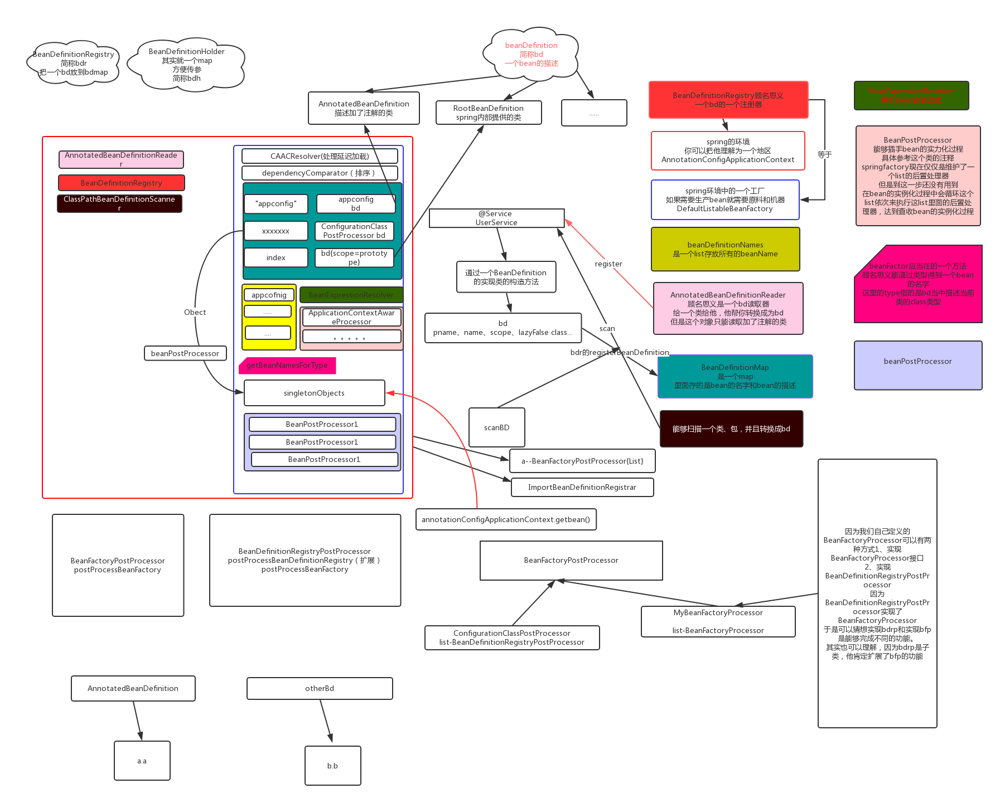

**Spring Context**

1.Spring容器的初始化过程

1.1 创建beanFactory
先执行AnnotionConfigApplicationContext的父类GenericApplicationContext的构造方法，创建beanFactory(DefaultListableBeanFactory)
    给beanFactory添加了5个beanDefinition(如果开启了JPA的支持，就会有6个)
    ConfigurationClassPostProcessor 实现了BeanDefinitionRegistryPostProcessor接口
    AutowiredAnnotationBeanPostProcessor 实现了BeanPostProcessor
    CommonAnnotationBeanPostProcessor 实现了BeanPostProcessor
    EventListenerMethodProcessor 实现了BeanFactoryPostProcessor
    DefaultEventListenerFactory

1.2 注册beanDefinition，beanFactory中有一个beanDefinitionMap专门存放beanDefinition
一般是调用register方法注册配置类
    1.2.1 实际调用AnnotatedBeanDefinitionReader的doRegisterBean方法，将java对象解析成beanDefinition,注意：这里的beanDefinition
            只包含配置类AppConfig
    1.2.2 调用DefaultListableBeanFactory的registerBeanDefinition方法，将beanDefinition存人beanDefinitionMap中
    
1.3 refresh，最核心的方法
    1.3.1 准备工厂，给beanFactory设置一些默认的解析器，注册器和后置处理器，还包括ApplicationListenerDetector（事件监听发现器）
    1.3.2 执行invokeBeanFactoryPostProcessors，这里主要是通过一些默认的BeanFactoryPostProcessor对配置类进行解析，得到bean definition
          作为beanFactory，就需要有解析配置类AppConfig的能力，这个工作就交给了ConfigurationClassPostProcessor
          这就是为什么beanFactory会在创建的时候就默认添加了5个后置处理器
=================================================解析配置类的逻================================================
          先解析配置类上的@ComponentScan注解，扫描包路径得到bean definition（用到了ASM),
          遍历上一步骤扫描得到的bean definitions，如果中间某个bean definition是一个配置类，就继续调用解析配置类的方法
          解析@Import注解，@Import可以传入三种不同的类:普通类、ImportSelector、BeanDefinitionRegistrar，但是在这一步spring并没有将通过
          @Import注入的类放入beanDefinitionMap中，而是放在ConfigurationClassPostProcessor的configurationClasses中
          包括配置类本身AppConfig，也会放入configurationClasses留在后续步骤处理
          =================================================解析配置类的逻辑================================================
    1.3.3 执行BeanFactoryPostProcessor接口的方法，主要是对配置类进行CGLIB增强，可以看到放入到beanDefinitionMap中到其实是AppConfig的代理对象
    
1.4 initApplicationEventMulticaster，就是注册一个applicationEventMulticaster（SimpleApplicationEventMulticaster)，以后有事件发布就通过这个广播器进行广播
    
1.5 注册监听器

1.6 finishBeanFactoryInitialization,通过反射创建单例对象，并执行BeanPostProcess的方法，并放入singletonObjects中，这涉及到bean的创建流程

1.7 finishRefresh，发布ContextRefreshedEvent
    

2.Bean的初始化